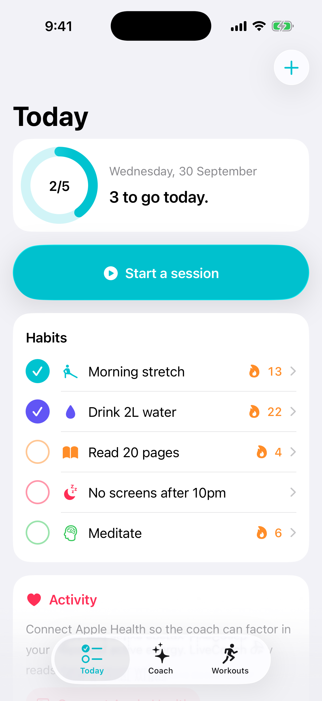
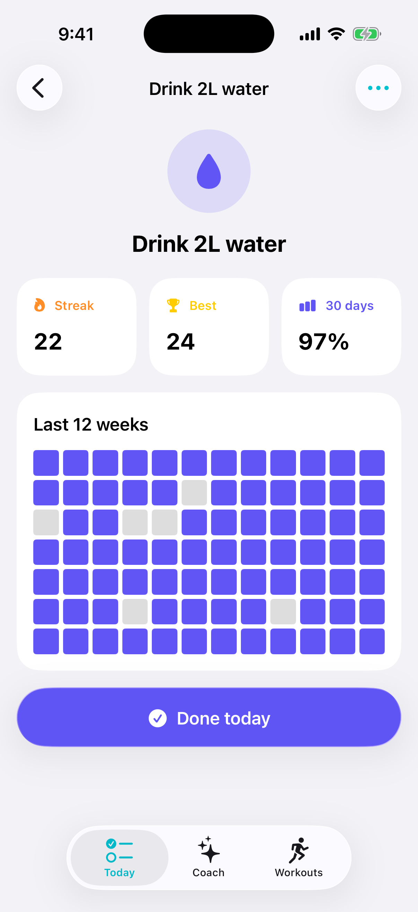
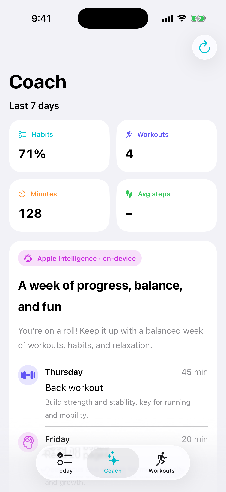
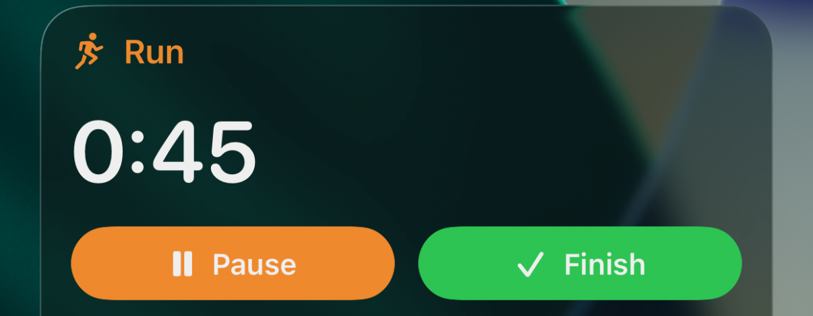
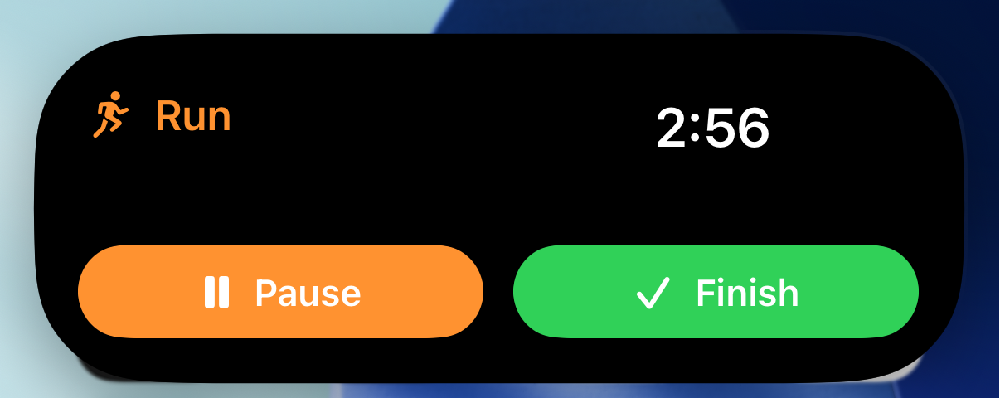
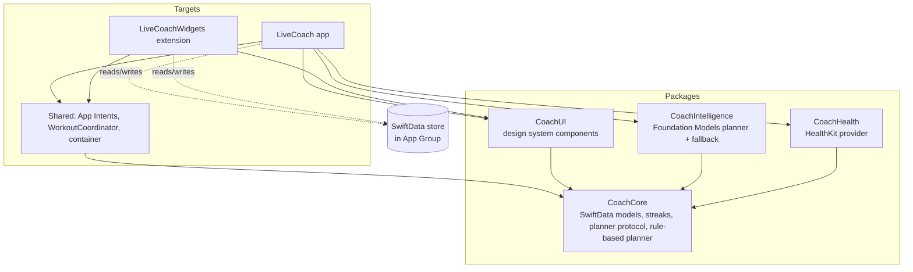

# LiveCoach

A native iOS habit and workout coach that plans your week with Apple's on-device model, and keeps your session timer on the Lock Screen and in the Dynamic Island.

[](https://github.com/OwaisMunawar/swiftui-live-coach/actions/workflows/ci.yml)
[](LICENSE)


<p>
  
  
  
  
</p>
<p>
  
</p>

All screenshots are unedited captures (cropped only) from the iOS 26.5 Simulator running the `-demoData` build.

## Why

Most habit apps stop at a checklist. I wanted a small, complete app that uses the parts of iOS that actually change how often people open it: the Lock Screen, the Home Screen, Siri, Health, and now an on-device language model. It is also a reference for how I structure a modern SwiftUI codebase: local Swift packages, Swift 6 strict concurrency, SwiftData shared across processes, and a domain layer that is tested without a simulator.

## Features

### Live Activities and Dynamic Island
- Start a run, strength, yoga, walk or focus session; a Live Activity shows the running timer on the Lock Screen and in the Dynamic Island (compact, minimal and expanded).
- **Pause/Resume** and **Finish** buttons run `LiveActivityIntent`s, so the session updates without opening the app.
- The timer uses `Text(timerInterval:)` driven by a pure `SessionClock`, so it ticks without any push updates or timeline reloads.

### Widgets
- Interactive "Today's Habits" widget (small, medium, large). Each check is a `Button(intent:)` that toggles the habit from the Home Screen and reloads the timeline.
- The widget reads the same SwiftData store as the app through an App Group.

### App Intents, Siri and Shortcuts
- `AppShortcutsProvider` with phrases such as "Start a workout in LiveCoach", "Start a run workout in LiveCoach" and "Log Meditate in LiveCoach".
- `HabitEntity` is an `AppEntity` backed by SwiftData with string search, so Siri can resolve habits by name.
- `livecoach://` URL scheme for deep links (`today`, `coach`, `workouts`, `habit/<name>`, `workout/start/<kind>`).

### HealthKit
- Reads step count and active energy (read-only) with `HKStatisticsCollectionQueryDescriptor`, bucketed per calendar day.
- Permission is only requested when the user taps **Connect Apple Health**. Empty data (always the case in a fresh Simulator) shows an explanatory empty state instead of zeros.

### On-device AI
- The Coach tab turns the last seven days into a plan for the next seven using **Foundation Models** guided generation. The model fills a `@Generable` struct with `@Guide` constraints (weekday names, workout kinds, 10 to 75 minutes, 3 to 5 sessions), so there is no free-text parsing.
- `SystemLanguageModel.default.availability` is checked on every request. When the device is ineligible, Apple Intelligence is off or the model is still downloading, a deterministic rule-based planner produces the plan and the UI says why.
- Any generation error (guardrails, context size) also falls back to the rule-based plan rather than an error screen.

## Architecture



- **CoachCore** has no UI and no singletons. Planners conform to `PlanGenerating`, health data comes through `ActivityProviding`, and clocks are injected, so every rule is testable on macOS with `swift test`.
- **Shared** is compiled into both the app and the widget extension. It is the composition root for persistence and holds the App Intents used by the widget, the Live Activity and Siri.
- Feature state lives in `@Observable @MainActor` models (`CoachModel`, `HealthModel`, `AppRouter`) that receive their dependencies through an `AppDependencies` value.

Design decisions and the alternatives I rejected are in [docs/ARCHITECTURE.md](docs/ARCHITECTURE.md).

## Tech stack

| Area | Choice |
| --- | --- |
| UI | SwiftUI (iOS 26, Liquid Glass button styles), Swift Charts |
| State | Observation (`@Observable`), SwiftData `@Query` |
| Persistence | SwiftData in an App Group container |
| Concurrency | Swift 6 language mode, complete strict concurrency, warnings as errors |
| System | ActivityKit, WidgetKit, App Intents, HealthKit, Foundation Models |
| Modules | Local Swift packages under `Packages/` |
| Project | XcodeGen (`project.yml`); the `.xcodeproj` is generated and not committed |
| Quality | Swift Testing, SwiftLint, GitHub Actions |

## Quick start

Requires Xcode 26 or later.

```sh
brew install xcodegen
xcodegen generate
open LiveCoach.xcodeproj
```

Run the `LiveCoach` scheme on an iOS 26 simulator. To start with sample habits and workouts, enable the `-demoData` launch argument in the scheme (Product > Scheme > Edit Scheme > Arguments). Running on a device needs your own team set in Signing & Capabilities, since no team ID is committed.

## Quality

- **34 Swift Testing tests** across the packages, including parameterised cases. They cover streaks across DST transitions in four time zones, travel across time zones, the day Samoa skipped in 2011, session pause/resume maths, SwiftData toggle/cascade behaviour, week summaries, the rule-based planner, the on-device-to-rule-based fallback, and prompt construction.
- Run them without a simulator:
  ```sh
  swift test --package-path Packages/CoachCore
  ```
  or all at once through the app scheme with `xcodebuild -scheme LiveCoach -destination 'platform=iOS Simulator,name=iPhone 17 Pro' test`.
- Swift 6 complete concurrency checking with warnings treated as errors; the app, widget and packages build with zero warnings.
- `swiftlint lint --strict` runs in CI alongside package tests and a full simulator build and test.
- Accessibility: Dynamic Type throughout (text styles and `@ScaledMetric`), VoiceOver labels, values and hints on the custom check buttons, rings, stat tiles and heatmap.

## Roadmap

- Home Screen widget screenshot for the README (the widget works; adding it to the Simulator Home Screen is manual).
- Weekly targets (e.g. 3x a week) alongside daily habits.
- Write completed sessions back to HealthKit as workouts, behind a separate permission.
- Snapshot tests for the CoachUI components and a UI test for the start/pause/finish flow.
- Push-to-update Live Activities so a session started on another device stays in sync.
- Localisation beyond English.

---

Built by [Owais Munawwar](https://github.com/OwaisMunawar) — available for React Native, AI and iOS work on [Upwork](https://www.upwork.com/freelancers/owaism11).
